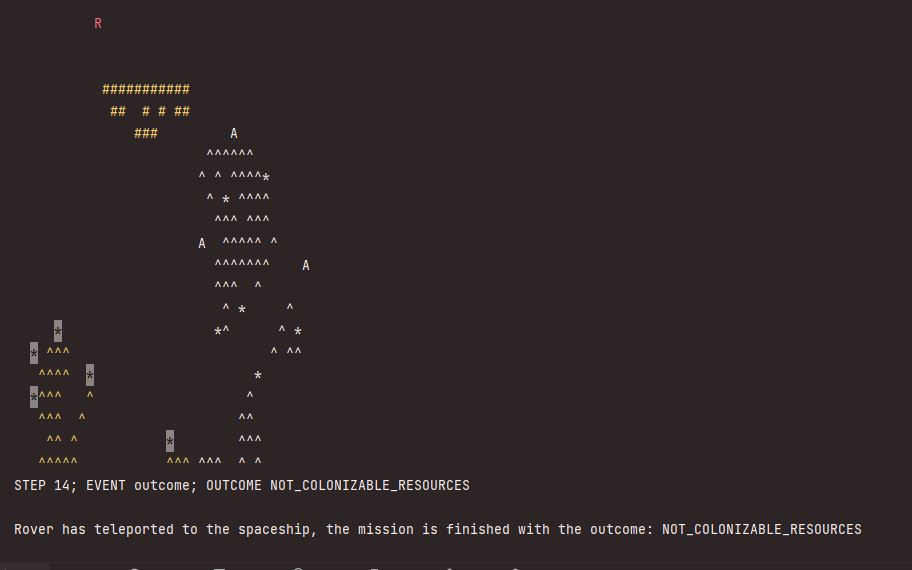
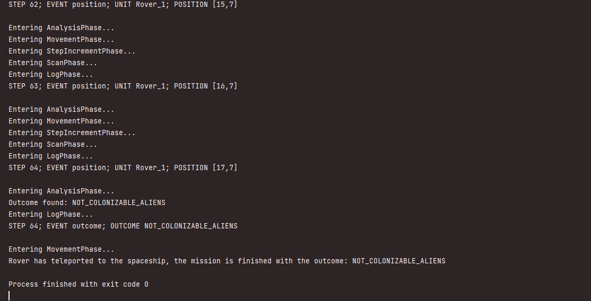
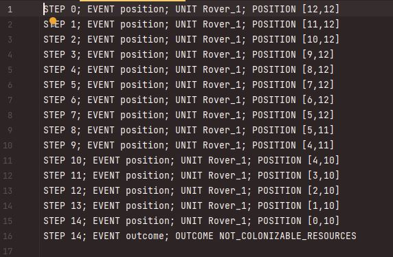

# Mars-exploration-2

## Project Overview:
In the second sprint of our Mars Exploration project, we've built upon our first sprint's work, where we developed a randomized map generation module. This time, we've focused on simulating a Mars Rover moving on such a map. This phase, like the previous one, is entirely developed in Java, a powerful, object-oriented programming language.

## Design Philosophy:
Our program design embraces the principles of encapsulation, a fundamental aspect of object-oriented programming. This allows us to bundle the rover's attributes and behaviors within distinct classes, making the codebase organized and maintainable.

## Navigation Algorithms:
The Mars Rover employs sophisticated algorithms to navigate through the map. These algorithms allow the rover to explore intelligently, prioritizing areas rich in resources and avoiding potential pitfalls or obstacles.

## Visualization: 
The rover's journey is visualized in two distinct ways. Firstly, we create a vivid representation of the rover's movements through a dynamic ASCII map in the console. Color-coding helps to highlight the rover's current position and other significant landmarks on the map. Secondly, an alternative text-based display logs each step of the Rover's journey in the console, providing real-time updates on its progress. At the mission's conclusion, this log will indicate whether the location is colonizable or not, and if it's not suitable for colonization, the specific reason will be displayed.

## Logging and Recording:
To ensure a lasting record of the rover's mission, we've implemented a detailed logging system. This records each step and discovery made by the rover during its journey. These logs are written to a file, providing a valuable data source for later analysis and review.

## Conclusion:
This project stands as a proof to the potential of Java classes to model complex real-world scenarios. Through the encapsulation of attributes and behaviors into distinct classes, we've created a simulation that captures the intricacies of a Mars Rover navigating a challenging landscape. We hope this combination of theoretical foundations with practical implementation not only demonstrates the capabilities of object-oriented programming but also provides meaningful insights into the challenges and opportunities of Mars exploration.

## Screenshots

Display of the Rover moving in map:

Display of Rover progress in mission as inline messages:

Recorded logs of the mission:

